# Protocol Activity Modeling Language

PAML (Protocol Activity Modeling Language) uses the UML Activity Model to represent protocols.

UML defines concepts Behavior, Event and Trigger that are used in modeling behavior.
A Behavior models dynamic change, and UML has three forms of behavioral model, one of which is the activity model.
Basic concepts of behavioral modeling are described in section 13 of the UML specification.

An activity model describes the data and control flow among executable atomic behaviors called actions.
The model is a graph with nodes for actions, objects (e.g., data) and control, and edges representing flow of objects and control. Control nodes determine when actions are performed.
In the UML specification, Activities are defined in section 15, and actions in section 16.

> This document uses [mermaid-js](https://mermaid-js.github.io/mermaid/#/) notation for class diagrams,
> You may need to enable mermaid in your viewer to see them properly.

## Protocols

A protocol is an activity with a list of materials, and input/output parameters determined by the activity.

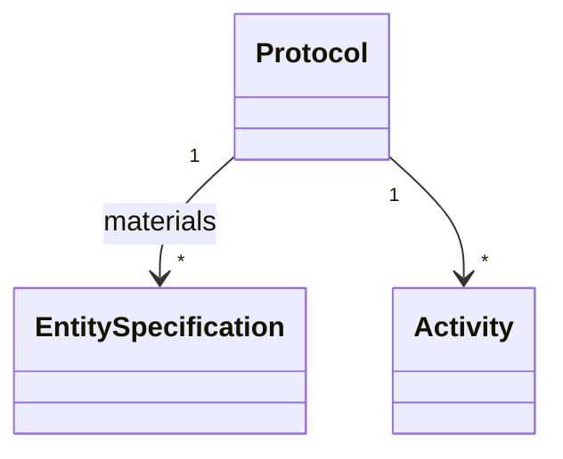

For the protocol to be well-formed, the materials must each have a corresponding `ProvisionAction` within the activity.

## Activities

We adopt the UML activity model as a whole with specified exclusions and extensions.

This model is defined in Sections 15 and 16 of the UML specification along with concepts defined in other sections.
This portion of the UML specification should be treated as the primary definition of the activity model.

### Behaviors

A Behavior is an abstract activity with inputs and outputs and pre- and post-conditions. Inputs and Outputs are either Object nodes in the activity graph, or the input/output pins of an action.

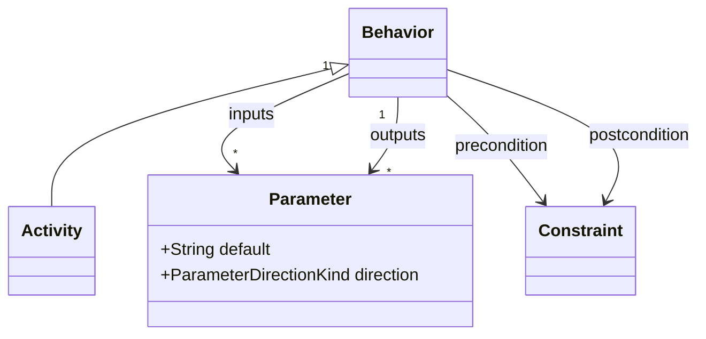

### Graph

An Activity consists of the activity graph nodes and edges.
Each edge may have a guard, which is a BLAH, and a weight, which is a BLAH.

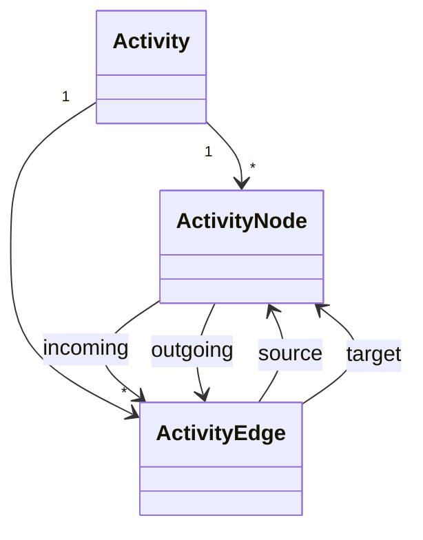

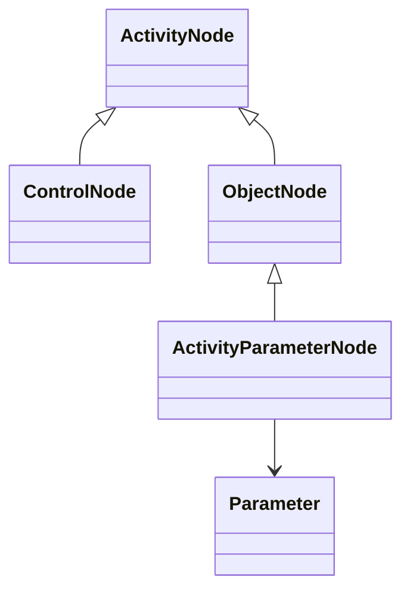

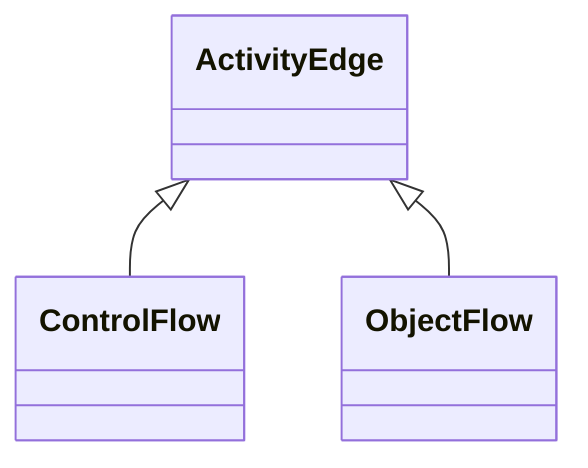

### Control

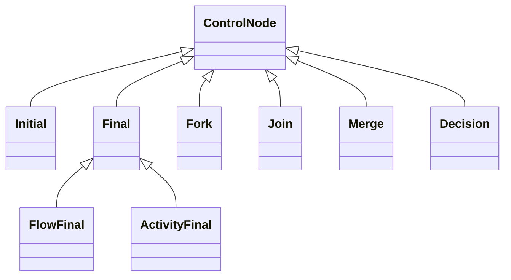

### Action

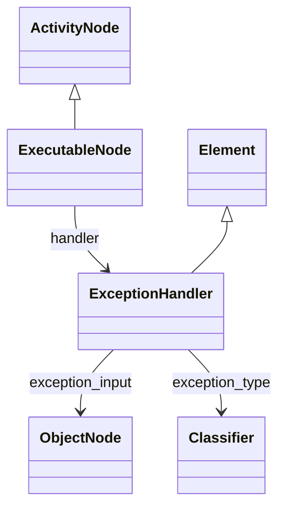

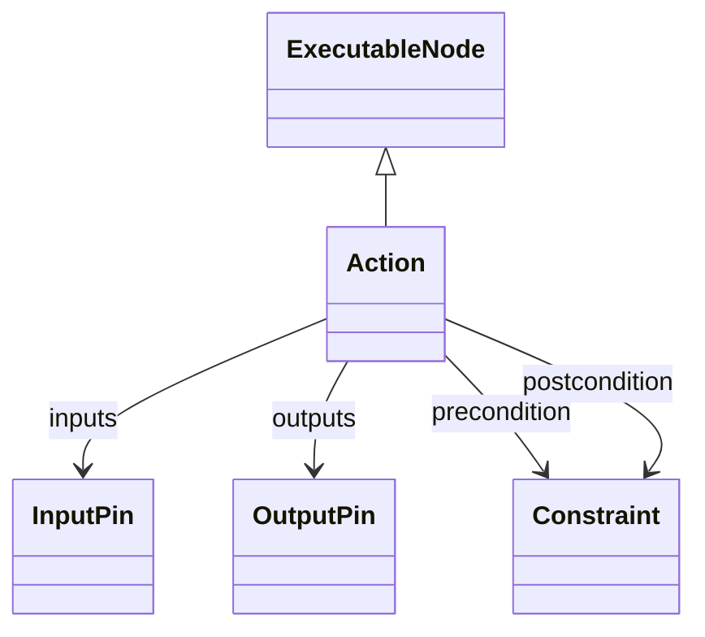

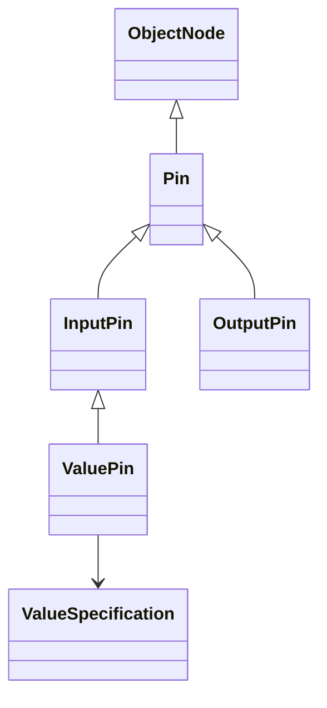

### Invocation

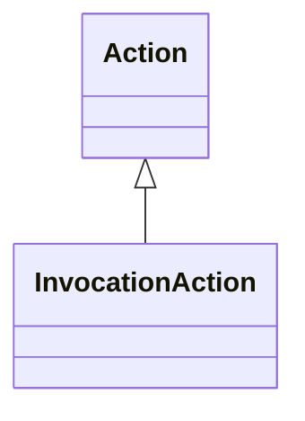

### Object

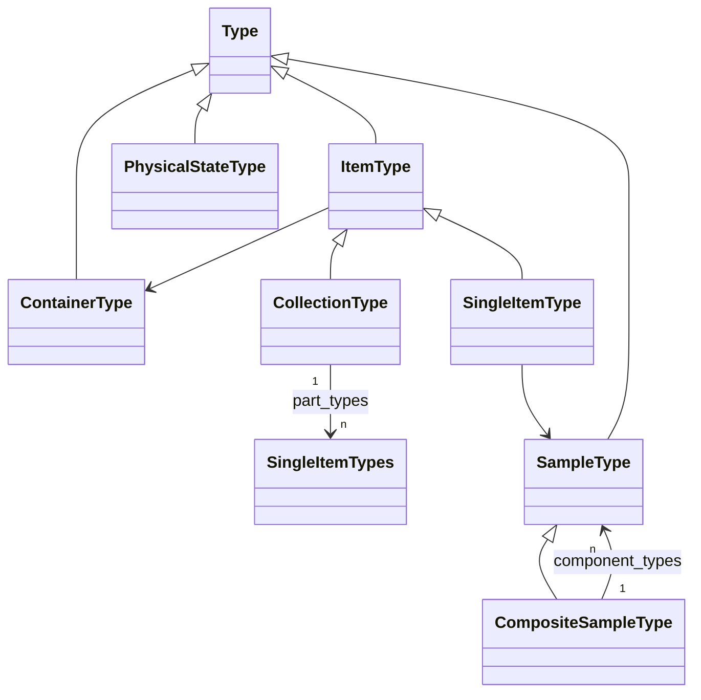

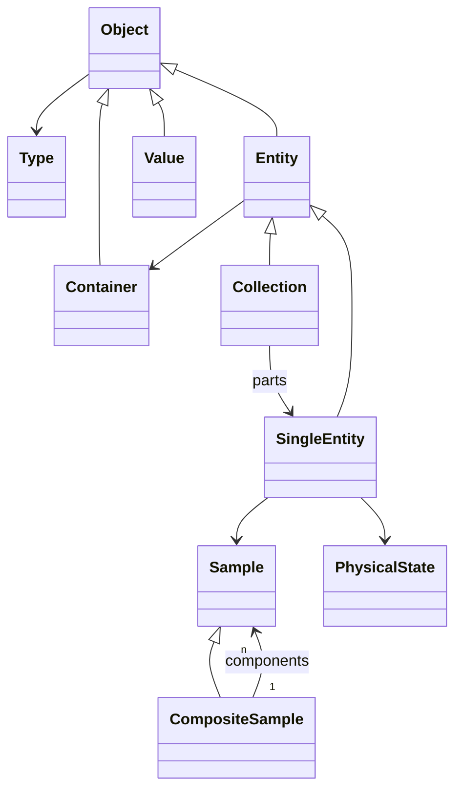
